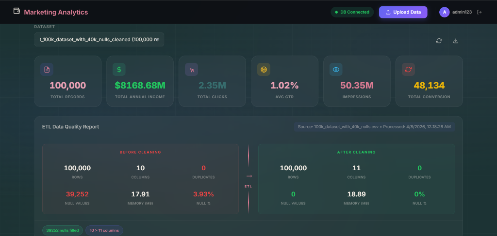
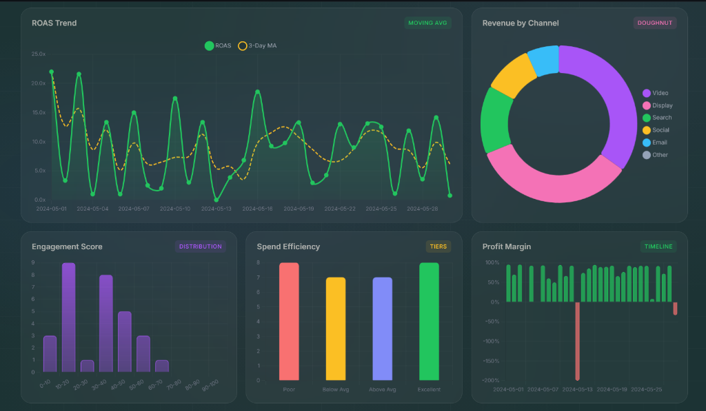

# ReFyn Automated ETL & Marketing Analytics

ReFyn is a next-generation automated ETL pipeline and marketing analytics platform. It automatically ingests raw marketing CSV data, cleans it, processes advanced analytical features (like ROAS, engagement scores, anomaly detection, and profit margins), and visualizes the insights on a highly responsive, premium Flask/Chart.js dashboard.

## Overview

The platform consists of three core components:
1. **Dynamic ETL Engine**: A schema-agnostic Python pipeline that intelligently maps arbitrary user columns, infers missing values, removes bot traffic, detects numerical outliers via z-scores, and calculates rich temporal and performance metrics.
2. **Airflow Orchestration**: Batch scheduling and workflow monitoring, running inside a dedicated Docker environment.
3. **Flask Web Dashboard**: A modern, dark-themed UI providing real-time data exploration, dynamic column detection, interactive charts, data quality scorecards, anomaly reports, and LLM-powered business insights via Google Gemini.

## Features & Advanced Analytics

The platform has recently been upgraded to feature highly advanced data transformations:

- **Automated Data Cleaning**: Drops duplicates, fills missing values, and standardizes numerical types.
- **Dynamic Schema Mapping**: Identifies generic columns (Spend, Impressions, Clicks, Revenue) across arbitrary datasets.
- **Advanced Feature Engineering**: 
  - **Funnel Metrics**: Computes ROAS (Return on Ad Spend), CPA (Cost Per Acquisition), CPC, CPM, and Profit Margins.
  - **Temporal Analysis**: Extracts day of week and calculates 3-day and 7-day Moving Averages for critical metrics.
  - **Scoring & Tiers**: Calculates a weighted Engagement Score and categorizes campaigns into Spend Efficiency Tiers (Poor to Excellent).
- **Comprehensive Anomaly & Bot Detection**:
  - Flags rows with CTR > 100%.
  - Detects statistical outliers using sophisticated Z-score thresholds.
  - Identifies suspicious bot traffic profiles (e.g., high clicks/impressions with zero conversions or revenue).
- **AI Business Insights**: Connects to the Gemini 2.0 Flash API to provide an automated, plain-text executive summary of marketing performance.

## User Interface

### Landing Page
A dynamic, beautifully crafted entry point that welcomes users to the analytics suite.


### Advanced Analytics Dashboard
A real-time metrics dashboard featuring multi-column layouts, animated KPI counters, area/grouped bar charts, and an anomaly review center.




## Getting Started

### Prerequisites
- Docker & Docker Compose
- Python 3.10+
- PostgreSQL
- Valid `GEMINI_API_KEY` for AI insights generation.

### Installation

1. **Clone the repository**
   ```bash
   git clone https://github.com/nagratana/ReFyn-Automated-ETL-pipeline.git
   cd ReFyn-Automated-ETL-pipeline
   ```

2. **Launch the Infrastructure (Airflow & Postgres)**
   ```bash
   docker-compose up -d
   ```

3. **Install Backend Dependencies**
   ```bash
   pip install -r requirements.txt
   ```

4. **Initialize Database**
   ```bash
   psql -U your_user -d postgres -a -f init-db.sql
   ```

5. **Start the Flask Dashboard**
   ```bash
   export SECRET_KEY=$(python -c 'import secrets; print(secrets.token_hex(32))')
   python flask_app/app.py
   ```
   Navigate to `http://127.0.0.1:5000` to begin.

## Usage

1. **Upload Data**: Use the dashboard entry page to drag-and-drop your raw marketing CSV. The backend offloads the ETL to a background job.
2. **Review ETL Report**: Instantly compare rows, columns, nulls, and footprints before and after processing.
3. **Explore Dashboards**: Observe moving averages, cumulative revenue trends, conversion funnels, and efficiency tiers.
4. **Identify Flaws**: Use the Anomaly Detection tab to isolate rows mimicking bot interactions or statistical outliers.
